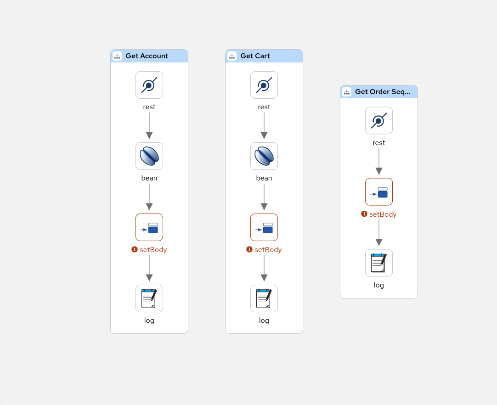

# Load generator


## Table of Contents
- [Load generator](#load-generator)
  - [Table of Contents](#table-of-contents)
  - [Context](#context)
  - [Routes](#routes)
    - [Account](#account)
    - [Cart](#cart)
    - [Sequence](#sequence)
  - [How to run](#how-to-run)


## Context
These routes are responsible for publishing 3 endpoints that will be used for querying mock data for the Data mapping demo.

### Routes
#### Account
- `GET localhost:8080/account`: This endpoint will return a mock account XML document. f.i.
```xml
<Account>
    <Name>Jane Doe</Name>
    <Address>Purkyňova 111, 612 00</Address>
    <City>Brno-Medlánky</City>
    <Country>Česká republika</Country>
</Account>
```

#### Cart
- `GET localhost:8080/cart`: This endpoint will return a mock cart XML document. f.i.
```xml
<Cart>
    <Item>
        <Title>Shadowman T-shirts</Title>
        <Note>XL</Note>
        <Quantity>10</Quantity>
        <Price>25.00</Price>
    </Item>
    <Item>
        <Title>Kaoto T-shirts</Title>
        <Note>L</Note>
        <Quantity>5</Quantity>
        <Price>24.50</Price>
    </Item>
</Cart>
```

#### Sequence
- `GET localhost:8080/sequence`: This endpoint will return a mock sequence number. f.i.
```
123456789
```

### How to run
1. Open the [load-generator.camel.yaml](load-generator.camel.yaml) file in Kaoto
2. Click on the `Run` button
3. You can now query the endpoints using the provided URLs
```shell
curl localhost:8080/account
curl localhost:8080/cart
curl localhost:8080/sequence
```
